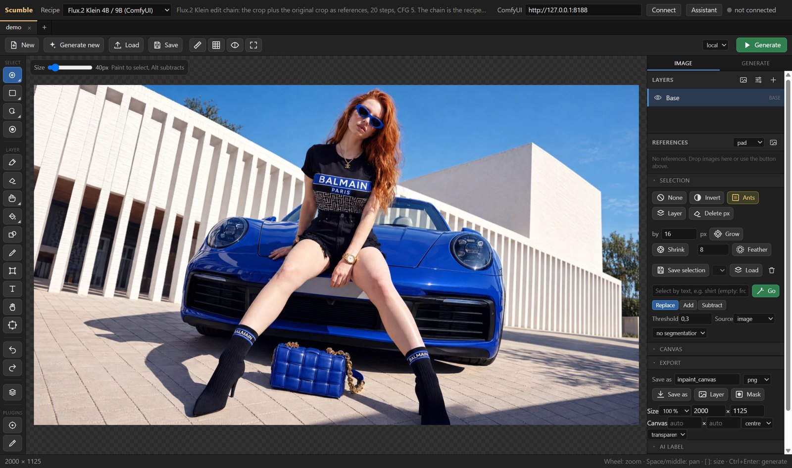
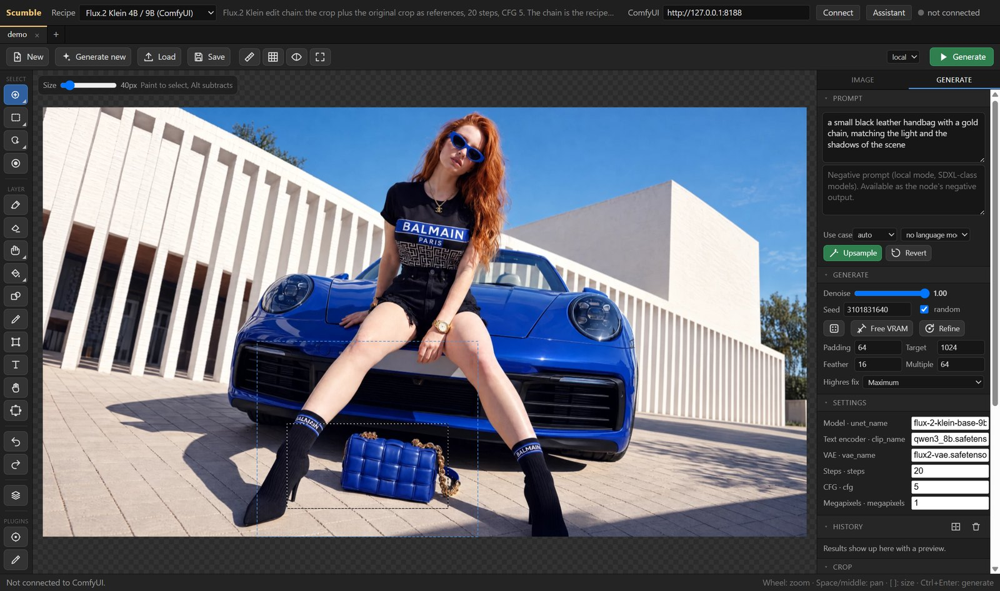
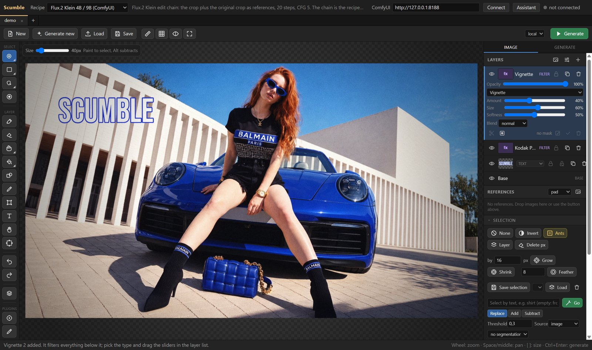
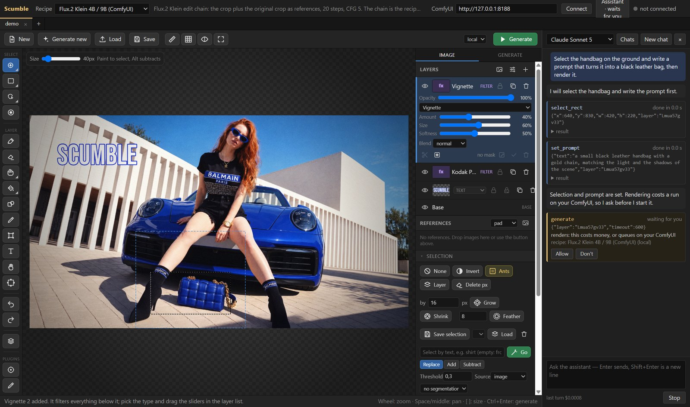
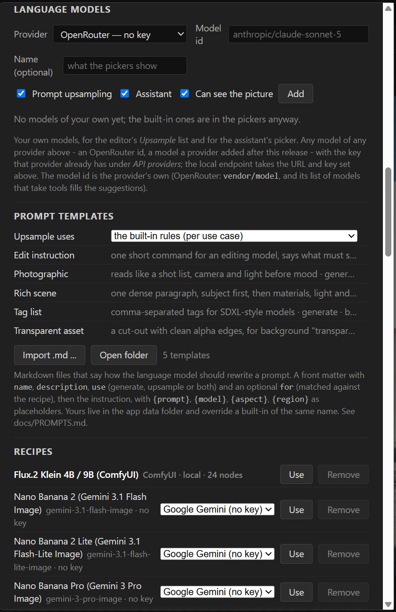

# Scumble

> **Work in progress.** Scumble is in an early state (0.1.x). Not every feature has been
> tested end to end yet, and the API provider adapters (ToAPIs, Google Gemini, OpenAI, Black Forest
> Labs, fal.ai, Replicate, WaveSpeedAI, Comfy Cloud, OpenRouter, BytePlus ModelArk) have been written from the providers'
> documentation but have not run against the live APIs so far. The same goes for the assistant: it
> reaches every provider it lists, but no model has completed a task against a live API yet. Expect
> rough edges, keep backups of your images, and please report what breaks in the
> [issues](https://github.com/DenRakEiw/scumble/issues).

A desktop editor for AI inpainting. Open an image, select an area (brush, shape, magic
wand, object hover or a text description), write a prompt, generate. The result lands as a
layer over the selection and can be blended in with colour match, erased in parts,
regenerated, stacked with filter and text layers, and exported with all layers to PSD or
OpenRaster. Or open the assistant and say what you want: it drives the same editor through
the same commands an external agent gets, one card per step, and asks before anything costs
money.



Rendering happens on your own [ComfyUI](https://github.com/comfyanonymous/ComfyUI)
(local or remote, for example on RunPod) or through API providers: Google (Nano Banana
2 / 2 Lite / Pro), OpenAI (GPT Image 2.5 Flare / Sunburst, 2), Black Forest Labs
(FLUX.2 max / pro / flex / klein, FLUX.1 Fill), ByteDance Seedream 5, Qwen Image Edit,
each through the model's own API where Scumble has one (for Seedream that is ByteDance's BytePlus ModelArk) or
through ToAPIs, fal.ai, Replicate, WaveSpeedAI, Comfy Cloud and OpenRouter. Object masks and background removal
run inside the app through ONNX Runtime (SAM2, BiRefNet, RMBG). The editor is the same
code as the ComfyUI node [Inpaint Canvas](https://github.com/DenRakEiw/ComfyUI-InpaintCanvas);
Scumble is the standalone window around it, plus recipes, plugins, an MCP server and the assistant.

Windows first (installer below), Linux builds are planned. Free software, GPL-3.0.
What has been verified so far: local rendering through ComfyUI, the in-app helper models,
the film pack, the command core, the MCP server, the tile engine on large documents and
auto-update; the API providers and the assistant's model calls are untested against the live
services (see the note above).

## Features

### Select, prompt, generate

Paint a selection (or draw a rectangle, an ellipse, a lasso, use the magic wand, hover an
object, or type "the handbag" for a text selection), write the prompt in the Generate tab,
press Generate. The recipe decides where it runs: your ComfyUI, or a provider with a key.



- Selection by brush, rectangle, ellipse, lasso, magic wand, object hover (SAM2 in-app)
  or by text (SAM3 on the ComfyUI side); grow, shrink, feather, invert, from layer, saved
  selections.
- Recipes instead of node graphs: pick a model ("FLUX.2 [max]", "Nano Banana 2") and the
  provider it runs on (ToAPIs, its own API such as BytePlus ModelArk for Seedream, fal.ai, Replicate, WaveSpeedAI,
  Comfy Cloud, OpenRouter); import your own ComfyUI
  workflow as a recipe if it holds an Inpaint Canvas node, or a copy of a shipped model recipe with
  a variant of your own.
- API runs go out at the size the provider really takes (*Highres fix* picks the tier), with
  reference layers, and transparent results from the OpenAI image models land as cut-outs.
- Start from nothing: *Generate new* makes the base image from the prompt alone, locally
  or through a provider, and you edit it from there.
- Prompt upsampling through a stored API key, an OpenRouter or ToAPIs key, or a local Ollama /
  LM Studio, with your own prompt-writing rules as Markdown templates.

### Layers, filters, text

Every result is a layer. Match its colours to what is below it, mask it, erase parts, set a
blend mode, put filter layers and text on top. Nothing is baked in until you flatten.



- A full layer stack: paint, image, text and filter layers, masks, blend modes, opacity,
  colour match per layer, retouch tools (clone, heal, smudge), transform, crop and extend,
  copy and paste of whole layers between tabs, SVG files as layers.
- Filter layers on the GPU (WebGL2): grain with film presets, curves, levels, colour
  balance, HSL, LUT (.cube), vignette, normalise, sharpen, blur and more; a film pack plugin with
  film looks, halation, glow, bleach bypass, cross processing, split toning, light leaks,
  frames and control points.
- A shape tool (rectangle, ellipse, polygon, Bezier, freehand path, fill and outline),
  custom brushes from Photoshop `.abr` files, and 3D objects (`.glb`) placed into the picture
  with their own light.
- Export PNG, JPEG, WebP, PSD and ORA with layers, masks and selections, at a percentage or
  in a frame of a given size; an *AI label* panel writes the EU AI label into the file.

### The assistant

A chat column next to the canvas. It runs on your own API key, on Anthropic, OpenAI, Google
or any OpenAI-compatible endpoint (OpenRouter, DeepSeek, Moonshot / Kimi, Z.ai / GLM,
ToAPIs, WaveSpeed, or a local server), and drives the editor through the same 60+ commands
an external MCP client gets. Every call is a card you can open; everything that costs money,
queues on your ComfyUI, clears the undo stack or touches a layer that is not its own asks
first.



- Ctrl+Z takes back each of its steps, and *Undo this turn* puts every document the turn
  touched back to what it was before, even when the turn was longer than the undo stack.
- Chats are saved as they go, with their screenshots, and can be reopened; *Settings >
  Assistant* deletes everything the assistant ever stored, your keys excepted.
- Your own model ids: *Settings > Language models* takes any model of any listed provider
  (an OpenRouter id, a model released after this version) for the assistant, for prompt
  upsampling, or both, on the key that provider already has.
- The whole feature, what leaves your machine per provider and what it costs:
  [docs/ASSISTANT.md](docs/ASSISTANT.md).



### Large pictures, plugins, agents

- A tile engine keeps the picture, every layer and every mask in tiles; the pixel kernels
  run as compiled Rust in workers, so a 15,000 x 10,000 document paints, saves, selects and
  exports without freezing the window, and PNGs beyond the canvas limit (up to 65,535 px a
  side, a gigapixel) open and save in strips.
- JavaScript plugins (filters with CPU and WebGL2 paths, panels, menu actions, tools,
  commands) and a command core with 60+ documented commands ([docs/COMMANDS.md](docs/COMMANDS.md)).
- MCP server: Claude Code, Claude Desktop or any MCP client can drive the editor (Help >
  Copy MCP registration puts the line for your client on the clipboard); `--headless` and
  `--cmd` for scripts ([docs/MCP.md](docs/MCP.md)).
- Tabs with session restore, a local file mirror (no server needed to reopen your work),
  API keys in the OS credential store, a console and a log file (Ctrl+Shift+L), auto-update
  from GitHub releases with the release notes shown before you restart.

The picture in the screenshots is a sample photo used to show the features; nothing in it
was generated with Scumble.

## Install (Windows)

Download `Scumble Setup <version>.exe` from the
[latest release](https://github.com/DenRakEiw/scumble/releases/latest) and run it. The
installer is not code-signed yet, so SmartScreen shows "Windows protected your PC" once:
click *More info*, then *Run anyway*. Updates are downloaded by the app itself (Settings >
Updates), which also shows what changed, and do not go through SmartScreen again.
[CHANGELOG.md](CHANGELOG.md) lists every version. How releases are built, who approves
them and what the app sends over the network is in the
[code signing policy](docs/CODE_SIGNING_POLICY.md).

For local rendering you need a ComfyUI with the node pack
[ComfyUI-InpaintCanvas](https://github.com/DenRakEiw/ComfyUI-InpaintCanvas) installed and
the models of the recipe you pick (the shipped Flux.2 Klein recipe wants the Flux.2 Klein
9B model, the Qwen3 8B text encoder and the Flux.2 VAE; the recipe's Settings panel lets
you choose the file names you have). For an API provider put the key into Settings > API
providers; no ComfyUI is needed then. The same key rows serve the assistant and prompt
upsampling (Anthropic, OpenAI, Google, OpenRouter, DeepSeek, Moonshot, Z.ai, ToAPIs,
WaveSpeed), plus a local OpenAI-compatible endpoint that needs no key. The *get a key* links
of ToAPIs and WaveSpeedAI carry the author's referral code.

## First steps

Type the ComfyUI URL in the top bar (default `http://127.0.0.1:8188`), Connect, open an
image (Ctrl+O, drop, paste), paint a selection, type a prompt, Generate (Ctrl+Enter).
Ctrl+S saves the visible image. Every document is a tab (Ctrl+T new, Ctrl+W close,
Ctrl+Tab next); a run keeps going while another tab is in front. Ctrl+, opens the settings
(server and auth, API keys, language models, recipes, helper models, assistant, plugins,
local files, rendering, updates). Ctrl+Shift+A opens the assistant.

Every image the editor uploads or receives is kept under `%APPDATA%/Scumble/files/`
(`input/` and `output/`, mirroring ComfyUI's folders). The server only holds copies:
before a run the app uploads what the server lacks, so a fresh or restarted ComfyUI
(RunPod) works without re-loading the document, and the last session is restored at
start even while no server is connected.

## Run from source

```
npm install
npm start
```

Build the installer with `npm run dist` (`dist/Scumble Setup <version>.exe`, NSIS,
unsigned). Releases are built by GitHub Actions: pushing a tag `v<version>` that matches
`package.json` publishes a draft release with the installer, its blockmap and `latest.yml`
(the auto-update feed); publishing the draft makes it visible to the app. The Rust pixel
kernels are committed as `renderer/editor/px/px.wasm`; `python tools/build_px.py` rebuilds
them.

Tests (`tools/`): `smoke_test.py` (needs a ComfyUI), `commands_test.py` (command core and
the sample plugin), `film_test.py` (GPU and CPU paths of the film pack), `mcp_test.py`
(the MCP server over stdio), `assistant_test.py` (the assistant against a scripted mock of
all four model families, with `assistant_test.js` for the loop in plain Node),
`llm_test.py` (the OpenAI-compatible upsample endpoint against a mock server, and the
user's own model rows), `toapis_test.py`, `openrouter_test.py` and `ark_test.py` (each
adapter in plain Node, then the app against a mock of the service), `recipes_test.py`
(every shipped recipe's settings rows and the importer), `editor_test.py` (editor
behaviour that is easy to break again), `composite_test.py` (the GPU compositor against
Canvas 2D), `generate_test.py` (making an image from the prompt alone, against the
loopback provider), `export_test.py`, `huge_test.py` and `perf_test.py` (large
documents), `px_test.js` (the Rust kernels against their JavaScript twins),
`helpers_test.js` (ONNX modules without Electron). `tools/run_gates.sh` runs a list of
them on a fresh instance. See `CLAUDE.md` for the development notes.

## Layout

```
electron/main/     main process: window, scumble:// scheme with the ComfyUI proxy, websocket, menu, dialogs, settings,
                   file mirror, keys.js (safeStorage), recipes.js, llm.js + llm_custom.js (prompt upsampling, the user's
                   own models), providers/ (toapis, fal, replicate, bfl, openai, gemini, wavespeed, comfycloud, openrouter, ark),
                   onnx/ (SAM2, matting), plugins.js, updater.js (GitHub releases), bridge.js + local.js + mcp/ (agents),
                   assistant/ (the loop, the policy, the four model adapters, the chat store)
electron/preload.js
renderer/          shell.js (connection bar, recipe picker, tabs, settings), commands.js (the command core),
                   plugins.js (plugin loader and the `scumble` API), assistant.js (the chat panel)
renderer/editor/   the editor, shared with the ComfyUI node (docs/BUILD_NODE.md); host.js is the app side of it,
                   inpaint_filters_gl.js the WebGL2 filter path, stitch.js the in-app crop / stitch for provider runs,
                   inpaint_tiles.js + inpaint_arena.js + inpaint_pool.js the tile engine and its workers, px/ the Rust
                   kernels (wasm), inpaint_bands.js the strip writers
crates/px/         the Rust source of the pixel kernels
recipes/           ComfyUI recipes (API-format prompts with a fixed canvas node id) and model recipes (one per model, a variant per provider), docs/RECIPES.md
plugins/           built-in plugins: sample (one of every extension point), film (the film pack), glb (3D objects), ailabel (the EU AI label)
docker/runpod/     Dockerfile + provision.sh for a ComfyUI box on RunPod (draft, docs/RUNPOD.md)
tools/             build_node.py (the node's editor), build_px.py (the kernels), cdp.py (DevTools driver), the tests, run_gates.sh
docs/              BRIEF.md (vision, decisions, phases), ASSISTANT.md, COMMANDS.md, PLUGINS.md, FILM.md, MCP.md, RECIPES.md,
                   HELPERS.md, PROMPTS.md, BRUSHES.md, GLB.md, PERFORMANCE.md, BUILD_NODE.md, CODE_SIGNING_POLICY.md, images/
.github/workflows/ build.yml (Windows installer, draft release on a version tag)
```

## Licence

GPL-3.0, the same licence as the Inpaint Canvas node and ComfyUI. See `LICENSE`. Free to
use, modify and redistribute; modified versions must be published under the same licence.
Bundled fonts are OFL / Apache licensed, see `renderer/editor/fonts/licenses`. Film names
in the grain presets and the film pack are trademarks of their owners; the looks are
Scumble's own approximations, not licensed products.
