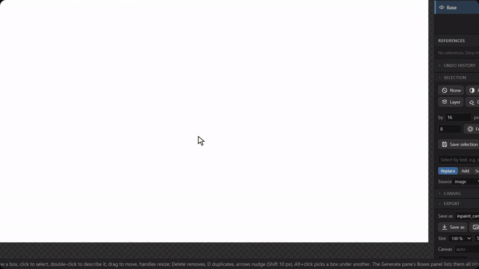
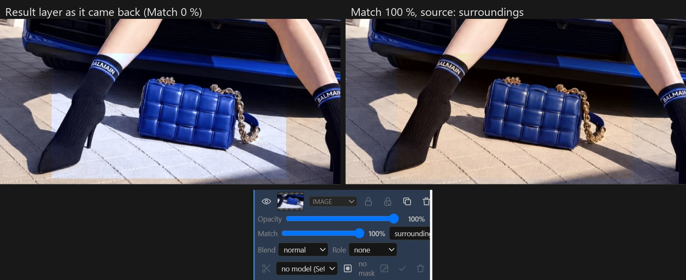
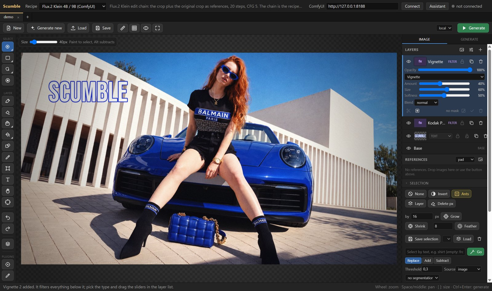
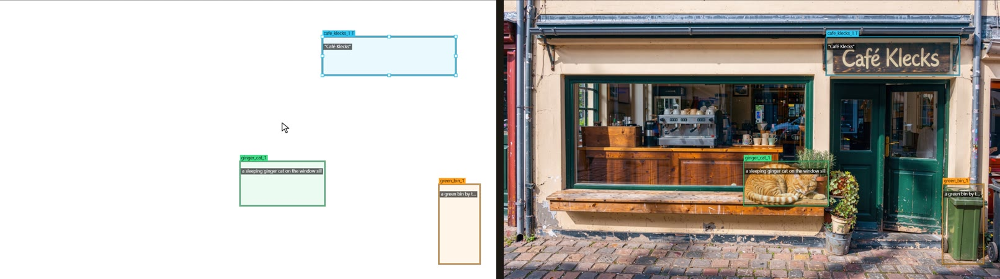
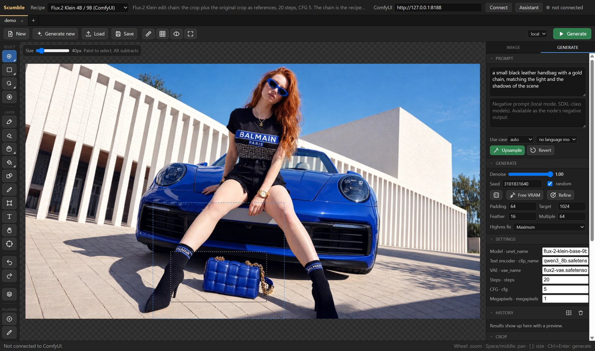

<h1 align="center">Scumble</h1>

<p align="center">
  <b>An AI-native image editor for ComfyUI and the models you already use.</b><br>
  Inpaint, edit, upscale and generate, and every edit comes back as a layer of its own.
</p>

<h3 align="center">
  ⭐ <a href="https://github.com/DenRakEiw/scumble">Star on GitHub</a>
  &nbsp;·&nbsp;
  <a href="https://github.com/DenRakEiw/scumble/releases/latest">Download</a>
  &nbsp;·&nbsp;
  <a href="https://apps.microsoft.com/detail/9NDBTNNMXF2R">Microsoft Store</a>
</h3>

<p align="center">
  <a href="https://github.com/DenRakEiw/scumble"></a>
  <a href="https://github.com/DenRakEiw/scumble/releases/latest"></a>
  <a href="https://apps.microsoft.com/detail/9NDBTNNMXF2R"></a>
  <a href="LICENSE"></a>
</p>

<p align="center">
  
</p>

## Get Scumble

| Platform | Get it | Notes |
|---|---|---|
| **Windows** | [Microsoft Store](https://apps.microsoft.com/detail/9NDBTNNMXF2R), or `winget install 9NDBTNNMXF2R` | Signed by Microsoft, no SmartScreen warning, updated by the Store |
| **Windows** | [Installer](https://github.com/DenRakEiw/scumble/releases/latest): `Scumble-Setup-<version>.exe` | Updates itself; not code-signed yet, so SmartScreen asks once |
| **Windows, portable** | [Zip](https://github.com/DenRakEiw/scumble/releases/latest): `Scumble-<version>-portable-win-x64.zip` | No install; keeps its data in a folder beside it |
| **Linux** (x64) | [AppImage or .deb](https://github.com/DenRakEiw/scumble/releases/latest) | Early builds made by CI, not run by the author yet; reports welcome |
| **macOS** | not yet | Planned, not started |

Scumble is free and needs no account of its own. The details, and what it needs to render, are under
[Installation](#installation).

## What can it do?

Scumble is a desktop image editor built around AI models. Select part of a picture, or draw boxes on an empty
canvas, say what should be there, and the answer comes back as a layer of its own, colour-matched to what surrounds
it, that you can mask, blend, filter and export like any other. It renders on your own ComfyUI (on your machine or a
remote one), on Comfy Cloud, or through the API keys you may already have for FLUX, GPT Image, Nano Banana, Seedream
and more: a key alone is enough, no ComfyUI needed. It is free software (GPL-3.0), runs on Windows today, and is
young (0.1.x), so expect rough edges and keep backups of your pictures.

## Five things it does well

### Every result is its own layer

A result lands over your selection as a new layer, faded in at the edge and colour-matched to the picture around it.
The Match slider in the layer's row changes that match at any time, and nothing else is baked in either: mask the
layer, erase parts, change its blend mode, put filters and text on top. The picture only becomes one when you flatten.



### Say where things go: boxes and `@img1`

Draw boxes on the picture and describe each one: something new, something kept, moved or removed, a reference picture
placed, words rendered. FLUX 3 Image from Black Forest Labs (on every provider Scumble runs it on) gets the boxes with
the prompt and is told where each thing goes; Ideogram 4 on fal takes the new, kept and text boxes. Reference layers
are named in the prompt as `@img1`, `@img2`, and each one goes out under the name the chosen model knows that picture
by.

### Your ComfyUI, Comfy Cloud, or just your keys

Recipes instead of node graphs: you pick a model and where it runs. On your own ComfyUI, local or on a rented box
such as RunPod, any workflow with the Inpaint Canvas node becomes a recipe, and the *ComfyUI* button opens your
ComfyUI's own page beside the editor to change a recipe's graph and save it back. Comfy Cloud runs on your Comfy key,
with 13 recipes from Comfy's own templates. Or paste a key into *Settings › API providers*: Black Forest Labs, OpenAI,
Google, fal.ai, Replicate, OpenRouter and more. Keys go into the system's credential store, never into a settings
file.

### Agents can drive it

Every feature is a command, and the commands are an MCP server: *Help › Copy MCP registration*, and Claude Code,
Claude Desktop or any other MCP client gets 105 tools to open, select, generate, match and export, in the same window
and with the same undo. (A built-in chat assistant on your own key is there too; see [The assistant](#the-assistant).)

### Made for real files

PSD export with layers and masks, OpenRaster with layers, and both open again with their layers. A tile engine with
compiled Rust kernels keeps a 15,000 × 10,000 pixel document painting, selecting and exporting without freezing the window, and
PNGs up to 65,535 pixels a side open and save in strips. Filters are layers too, on the GPU: 46 film looks, grain,
curves, LUTs and more.



The photo in the editor screenshots (the woman on the blue car) is a sample picture used to show the features;
nothing in it was generated with Scumble. The café picture at the top and below was made in Scumble with FLUX 3
Image.

## Before / After

<p align="center">
  
</p>

Three boxes drawn and described on an empty canvas (left), and the picture FLUX 3 Image made from them with
*Generate new* (right).

## Installation

### Windows (10 and 11, 64-bit)

- **Microsoft Store:** [Scumble in the Microsoft Store](https://apps.microsoft.com/detail/9NDBTNNMXF2R), or in a
  terminal:

  ```
  winget install 9NDBTNNMXF2R
  ```

  (winget installs the same Store copy and may ask you to accept the Store's terms first.) Microsoft signs the Store
  copy, so it installs without a SmartScreen warning, and the Store keeps it up to date. A new version arrives there
  after Microsoft has certified it, so sometimes a little after the GitHub release. The Store copy keeps its own
  settings, keys and files (`%APPDATA%\Scumble Store`), so it can sit beside the GitHub one.
- **Installer from GitHub:** `Scumble-Setup-<version>.exe` from the
  [latest release](https://github.com/DenRakEiw/scumble/releases/latest). It is not code-signed yet, so SmartScreen
  shows "Windows protected your PC" once: click *More info*, then *Run anyway*. After that the app downloads its own
  updates and asks before it restarts into a new version.
- **Portable zip:** `Scumble-<version>-portable-win-x64.zip` from the same release. Unpack it into a folder you can
  write to, such as `C:\Tools` (not Program Files, not a folder OneDrive syncs), and start the `Scumble.exe` in its
  `Scumble` folder (SmartScreen asks once, as for the installer). Everything it stores stays in a `data` folder beside it, so it runs beside an installed Scumble.
  It does not update itself: it tells you when a new version is out, and you unpack the new zip over the old one (the
  `data` folder stays). API keys are encrypted for the Windows account, so on another PC they have to be typed again
  (and after that possibly on the first PC too).

### Linux

The same release carries `scumble-<version>.AppImage` and `scumble-<version>.deb` (x64). **They are built by CI and
have not been run by the author yet; reports are welcome** in the
[issues](https://github.com/DenRakEiw/scumble/issues). Details are under [Linux notes](#linux-notes) below.

### macOS

Planned, not started yet.

### What you need to render

- **Only an API key:** *Settings › API providers* (Ctrl+,), paste the key, Save. No ComfyUI and no server; you pay
  the provider directly. The same keys serve the assistant and prompt upsampling.
- **Your own ComfyUI:** the node pack [ComfyUI-InpaintCanvas](https://github.com/DenRakEiw/ComfyUI-InpaintCanvas)
  installed there, and the models of the recipe you pick. Install the pack with git into ComfyUI's `custom_nodes`
  folder, then restart ComfyUI (the pack needs no extra Python packages):

  ```
  cd ComfyUI/custom_nodes
  git clone https://github.com/DenRakEiw/ComfyUI-InpaintCanvas
  ```

  The ComfyUI Manager does not list the pack at the moment; once it does, you can install it from there too. Then
  type the server's address in Scumble's top bar and press Connect. Scumble checks for the pack when it connects and
  says so when it is missing; it does not install it for you.
- **Comfy Cloud:** your Comfy key in *Settings › API providers*; the same key runs Comfy Router.

Without any of these Scumble still opens, paints, selects, layers, filters, saves and exports, and its in-app models
(object selection, background removal, Remove) run on your own machine once downloaded.

## Demo: videos and the manual

[](https://www.denrakeiw.com/scumble/videos)

- **[Videos](https://www.denrakeiw.com/scumble/videos):** "Scumble, explained by someone who did not ask" (4:40) and
  "Scumble, part two: he has more questions" (4:03), two voices, one of them a sceptic, recorded in the app at version 0.1.28 (boxes, the ComfyUI window and the
  newer recipes came later).
- **[Manual](https://www.denrakeiw.com/scumble/manual):** from the first picture to the export. The same text ships
  with the app: F1 opens it beside the picture, searchable and offline, and with any API key a chat answers questions
  from it. Its source is [docs/MANUAL.md](docs/MANUAL.md).

## ⭐ If you like it

If Scumble is useful to you, a [star on GitHub](https://github.com/DenRakEiw/scumble) helps other people find it.
Something broken? Open an [issue](https://github.com/DenRakEiw/scumble/issues) with what you did and what happened;
Ctrl+Shift+L opens the console, which shows the path of the log file. What is being built, what was measured and what
did not work is on the [dev blog](https://www.denrakeiw.com/scumble/blog), and [CHANGELOG.md](CHANGELOG.md) lists
every version.

---

## What has been tried live

Scumble is at 0.1.x and not every feature has been tested end to end. Run against the real thing so far: local
rendering through ComfyUI, the in-app helper models, the film pack, the command core, the MCP server, the tile engine
on large documents and auto-update; among the API providers FLUX 3 Image on Black Forest Labs (with boxes),
OpenRouter and Comfy Router, GPT Image 2.5 through OpenRouter, GPT Image 2 and Nano Banana 2 on Comfy Router,
Ideogram 4 on fal (with boxes), Qwen Image 2.1 Edit on Comfy Cloud, and the upscalers Topaz Precision on fal and
Magnific Precision and Creative on Magnific; on a local ComfyUI the Realism Pass (Windows only, RTX only) and RTX
Video Super Resolution, the latter once on Comfy Cloud too. The other API routes were built from the providers'
documentation and have not run against the live services yet, nor have the assistant's model calls, the portable zip
on a second PC, or the Linux builds.

## Features in detail

### Select, prompt, generate



- Selection by brush, rectangle, ellipse, lasso, magic wand, object hover (SAM2, in the app) or by text (SAM3 on your
  ComfyUI); grow, shrink, feather, invert, from layer, saved selections.
- Models: FLUX 3 Image, FLUX.2 (max, pro, flex, klein) and FLUX.1 Fill from Black Forest Labs; GPT Image 2.5 Flare /
  Sunburst and GPT Image 2; Nano Banana 2.1, 2, 2 Lite and Pro; Seedream 5 and 4.5; Qwen Image Edit and Qwen Image 2.1;
  Ideogram 4 and 4.5; Grok Imagine, Krea 2, Recraft V4, Reve, Z-Image and HY Image 3.5; Magnific's Mystic, Ideogram
  inpainting and Image Expand outpainting. Each runs on the model's own API where Scumble
  has one, or through ToAPIs, fal.ai, Replicate, WaveSpeedAI, Comfy Cloud, Comfy Router, OpenRouter, Oxen.ai and
  Magnific. API runs go out at the size the provider really takes, with your reference layers.
- Your own workflow becomes a recipe when it holds an Inpaint Canvas node. The *ComfyUI* window (Ctrl+Shift+K) shows
  your ComfyUI's page or Comfy Cloud; *Edit in ComfyUI* opens a recipe's graph there, and *Save to recipe* or *Save as
  new recipe* brings it back.
- Comfy Cloud has a mode of its own beside *local* and *api*. Thirteen recipes from Comfy's templates come with
  Scumble (image edits, and new images for Generate new); *Cloud copy* turns one of your ComfyUI recipes into one that
  runs there, and a workflow made on Comfy Cloud imports as it is.
- *Generate new* makes the base picture from the prompt alone, locally or through a provider, and you edit it from
  there.
- Boxes in the prompt for FLUX 3 Image and Ideogram 4 (on fal): the Boxes tool (X) draws them, a double-click
  describes one right on the picture, one switch under the prompt turns them on and off, and they are saved with the
  document. With the switch on and no boxes drawn, the selection goes as one box. Ideogram 4 takes the new, kept and
  text boxes (it has no move, remove or reference boxes).
- Prompt upsampling through a stored API key or a local OpenAI-compatible server, with your own prompt-writing rules
  as Markdown templates.

### Retouch, upscale, refine

- Clone, heal, smudge, dodge and burn, liquify, and *Patch* for a whole area. *Remove* and *Content-aware move* fill
  with LaMa, a model that runs inside Scumble: no prompt, no key, no ComfyUI (download it once in *Settings › Helpers
  (in-app models)*).
- Object masks (SAM2) and background removal (BiRefNet, RMBG) run in the app through ONNX Runtime.
- *Upscale* takes the selection (it comes back as a layer) or the whole picture (it becomes the new base, every layer
  and mask scaled along, in one undo step). Topaz, Clarity, SeedVR2, Recraft and Magnific through their providers; the
  upscale models of your own ComfyUI; RTX Video Super Resolution on your ComfyUI or on Comfy Cloud, 1 to 4 times.
- *Realism Pass (Windows only, RTX only)*, a refiner for generated pictures: it sends the picture through your own
  ComfyUI and adds the answer as a new layer, so generated skin, hair and fabric look more natural; at 1.5× to 3× it makes
  the picture larger in the same step. It needs a ComfyUI on Windows with an RTX 30, 40 or 50 card and a community node
  pack with its runtime, which you install there; Scumble ships none of it, and there is no Comfy Cloud version. The
  [manual](docs/MANUAL.md)'s chapter of the same name has the steps.

### Layers, filters, text

- A full layer stack: paint, image, text and filter layers, groups, masks, blend modes (the usual eight and linear
  light), opacity, transform, crop and extend (which is how outpainting starts), copy and paste of whole layers
  between tabs, SVG files as layers.
- Colour match per layer, non-destructive, matched to the picture around the layer or to what lies below it.
- Filter layers on the GPU (WebGL2, with a processor fallback): grain with film presets, curves, levels, colour
  balance, HSL, LUT (.cube), vignette, sharpen, blur and more. The film pack plugin adds 46 film looks, halation, glow,
  bleach bypass, cross processing, split toning, light leaks, frames and control points.
- A shape tool, custom brushes from `.abr` files, and 3D objects (`.glb`) placed into the picture with their own
  light.
- `.scumble` documents keep everything editable (layers, filters, text, 3D objects, prompts and results). Export
  PNG, JPEG, WebP, TIFF, PSD and ORA, at a percentage or into a frame of a given size; the *AI label* panel adds the
  EU's label for AI-generated content.

### The assistant

A chat column next to the canvas (Ctrl+Shift+A), on your own key: Anthropic, OpenAI, Google or any OpenAI-compatible
endpoint (OpenRouter, DeepSeek, Moonshot / Kimi, Z.ai / GLM, ToAPIs, WaveSpeed, Oxen.ai, or a local server). It drives
the editor through the same commands an MCP client gets. Everything that costs money, queues on your ComfyUI, clears
the undo stack or touches a layer it did not make asks first. Ctrl+Z takes back each of its steps; chats are saved
with their screenshots, and *Settings › Assistant* deletes everything it stored. What leaves your machine per provider
and what it costs: [docs/ASSISTANT.md](docs/ASSISTANT.md).

### Large pictures, plugins, agents

- The tile engine keeps the picture, every layer and every mask in tiles, and the pixel kernels run as compiled Rust
  in workers. PNGs beyond the browser's canvas limit (up to 65,535 px a side, about a gigapixel) open and save in
  strips.
- JavaScript plugins (filters with GPU and processor paths, panels, menu actions, tools, commands) and a command core
  with 105 documented commands, 88 core and 17 from the built-in plugins ([docs/COMMANDS.md](docs/COMMANDS.md),
  [docs/PLUGINS.md](docs/PLUGINS.md)).
- MCP server for any MCP client, plus `--headless` and `--cmd` for scripts ([docs/MCP.md](docs/MCP.md)).
- Tabs with session restore, a local file mirror (no server needed to reopen your work), a console and a log file,
  updates from GitHub releases with the release notes shown before you restart.

## Linux notes

The AppImage: `chmod +x` it and start it; it updates itself like the Windows app (the .deb does not: install the next
one over it). On Ubuntu 23.10 and later AppArmor's limit on unprivileged user namespaces may keep Electron's sandbox,
and so the AppImage, from starting; the .deb installs the sandbox helper properly. The helper models run on the
processor on Linux. API keys go into the desktop's keyring (GNOME Keyring, KWallet); without one, *Settings › API
providers* says the keys are only obfuscated.

## First steps

For an API model, put its key into *Settings › API providers* (Ctrl+,). For your own ComfyUI, type its URL in the top
bar (default `http://127.0.0.1:8188`) and press Connect. Then open a picture (Ctrl+O, drop, paste), paint a
selection, type a prompt and Generate (Ctrl+Enter). Ctrl+S saves the document as a `.scumble` file, Ctrl+Shift+E
exports the picture. Every document is a tab (Ctrl+T new, Ctrl+W close, Ctrl+Tab next); a run keeps going while
another tab is in front. Ctrl+Shift+A opens the assistant, F1 the manual.

Every image the editor uploads or receives is kept under `%APPDATA%/Scumble/files/` (in a portable copy `data/files/`
beside `Scumble.exe`), in `input/` and `output/` folders that mirror ComfyUI's. The server only holds copies: before a
run the app uploads what the server lacks, so a fresh or restarted ComfyUI (RunPod) works without reloading the
document, and the last session comes back at the next start even with no server connected.

## Run from source

```
npm install
npm start
```

`npm run dist` builds the installer (`dist/Scumble Setup <version>.exe`, NSIS, unsigned), then `npm run dist:portable`
the portable zip from the same build (`dist/Scumble-<version>-portable-win-x64.zip`). Releases are built by GitHub
Actions: a tag `v<version>` that matches `package.json` builds a draft release with the installer, its blockmap,
`latest.yml` (the auto-update feed) and the portable zip; publishing the draft makes it visible to the app. The Rust
pixel kernels are committed as `renderer/editor/px/px.wasm`; `python tools/build_px.py` rebuilds them.

The tests live in `tools/` ([docs/TESTING.md](docs/TESTING.md) says what each covers), and `tools/run_gates.sh` runs
a list of them on a fresh instance. How releases are built, who approves them and what the app sends over the network
is in the [code signing policy](docs/CODE_SIGNING_POLICY.md). See `CLAUDE.md` for the development notes.

## Layout

```
electron/main/     main process: window, scumble:// scheme with the ComfyUI proxy, websocket, menu, dialogs, settings,
                   file mirror, keys.js (safeStorage), recipes.js, llm.js + llm_custom.js (prompt upsampling, the user's
                   own models), providers/ (one adapter per API provider), onnx/ (SAM2, matting), plugins.js,
                   updater.js (GitHub releases), bridge.js + local.js + mcp/ (agents), assistant/ (the loop, the
                   policy, the four model adapters, the chat store), comfyview.js (the ComfyUI window),
                   documents.js + docfile.js (.scumble files)
electron/preload.js
renderer/          shell.js (connection bar, recipe picker, tabs, settings), commands.js (the command core),
                   plugins.js (plugin loader and the `scumble` API), assistant.js (the chat panel)
renderer/editor/   the editor, shared with the ComfyUI node (docs/BUILD_NODE.md); host.js is the app side of it,
                   inpaint_filters_gl.js the WebGL2 filter path, stitch.js the in-app crop / stitch for provider runs,
                   inpaint_tiles.js + inpaint_arena.js + inpaint_pool.js the tile engine and its workers, px/ the Rust
                   kernels (wasm), inpaint_bands.js the strip writers
crates/px/         the Rust source of the pixel kernels
recipes/           ComfyUI recipes, Comfy Cloud recipes and model recipes (one per model, a variant per provider),
                   docs/RECIPES.md
plugins/           built-in plugins: sample, film (the film pack), glb (3D objects), ailabel (the EU AI label),
                   boxes (boxes in the prompt), and two skins
docker/runpod/     Dockerfile + provision.sh for a ComfyUI box on RunPod (draft, docs/RUNPOD.md)
tools/             build_node.py (the node's editor), build_px.py (the kernels), cdp.py (DevTools driver), the tests,
                   run_gates.sh
docs/              MANUAL.md, BRIEF.md (vision, decisions, phases), ASSISTANT.md, COMMANDS.md, PLUGINS.md, FILM.md,
                   MCP.md, RECIPES.md, HELPERS.md, TESTING.md, CODE_SIGNING_POLICY.md and more, images/
.github/workflows/ build.yml (Windows installer and portable zip, Linux AppImage and .deb, draft release on a version tag)
```

The editor is the same code as the ComfyUI node [Inpaint Canvas](https://github.com/DenRakEiw/ComfyUI-InpaintCanvas):
if you work inside ComfyUI, you get the same canvas there.

## Licence

GPL-3.0, the same licence as the Inpaint Canvas node and ComfyUI. See `LICENSE`. Free to use, modify and
redistribute; modified versions must be published under the same licence. Bundled fonts are OFL / Apache licensed,
see `renderer/editor/fonts/licenses`. Film names in the grain presets and the film pack are trademarks of their
owners; the looks are Scumble's own approximations, not licensed products. The *get a key* links of ToAPIs and
WaveSpeedAI carry the author's referral code.
